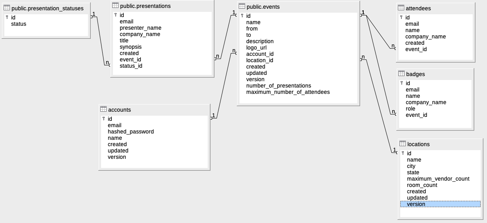

# Conference GO! Backend

This is the Conference GO! backend. It is a [Node.js](https://nodejs.org)
application that uses [Koa.js](https://koajs.com) as its routing and response
mechanism. It uses a PostgreSQL database and the
[node-postgres](https://node-postgres.com/) library to connect to the RDBMS. It
uses the [db-migrate](https://db-migrate.readthedocs.io/) library to manage the
migrations for the application. Finally, it uses the remarkable
[dotenv](https://github.com/motdotla/dotenv#readme) library for environment
management.

## Running the application locally

Here are the steps that you should go through to get a working local development
(or running) application.

### Getting the relational database set up

You must have an instance of PostgreSQL running for the app to work. If you're
not adverse to installing the RDBMS on your local system, you can do that using
macOS Homebrew or the package manager for you GNU/Linux distribution.

Once you have that, you need to create the database and its user for the
application. On macOS, Homebrew installs your user as a valid user, so you can
just run the following two commands. The first will create a user named
_conference_app_user_ with the password _5UvUwY3xRH86xXhx_. Then, the second
command creates a database named _conference_app_ owned by the
_conference_app_user_. Feel free to change those values as you want. Then, put
them in the `.env` file mentioned later in the _Setting up your environment_
section.

```sh
# For PostgreSQL installed with Homebrew
psql postgres -c "CREATE ROLE conference_app_user WITH LOGIN CREATEDB PASSWORD '5UvUwY3xRH86xXhx';"
psql postgres -c "CREATE DATABASE conference_app WITH OWNER conference_app_user;"
```

If you installed PostgreSQL using a package manager for your Linux distribution,
use `sudo` to change your user to the _postgres_ user.

```sh
# For PostgreSQL installed with a package manager like apt
sudo -u postgres psql -c "CREATE ROLE conference_app_user WITH LOGIN CREATEDB PASSWORD '5UvUwY3xRH86xXhx';"
sudo -u postgres psql -c "CREATE DATABASE conference_app WITH OWNER conference_app_user;"
```

### Using the right version of Node.js

There is a `.nvmrc` file that pins the version of Node.js to use. To install
dependencies, make sure you have [Node Version
Manager](https://github.com/nvm-sh/nvm) or [Node Version Manager for
Windows](https://github.com/coreybutler/nvm-windows) installed and run the
following.

If you have any problems, check out the troubleshooting steps in the
installation instructions.

```sh
# Should work for Bash and Z-shell
nvm install $(cat .nvmrc)
nvm use
```

If you have any problems with nvm and are using macOS Catalina, try the
following, then restart your terminal instance.

```sh
# Should work for Bash and Z-shell
touch ~/.zshrc
. ~/.nvm/nvm.sh
```

If you plan on doing development, then run

```sh
# For development
npm install
```

If this is "production", then run

```sh
# For production
npm install --prod
```

### Setting up your environment

The `template.env` file contains the skeleton of the environment variables
needed to get the application running. **Copy** it to `.env` and set the values
to your liking. Make sure to set `PGUSER` and `PGPASSWORD` to the value that you
used in the database section above.

Here's what `template.env` looks like.

```sh
# The port to serve the application from like 8080.
PORT=

# The secret to use for signing and verifying JWTs. Just set this to some
# random text that you mash out on your keyboard, if you'd like.
JWT_SECRET=

# The variables to connect to the PostgreSQL database. "Normal" values are
# shown as comments on the same line.
PGHOST=       # localhost
PGPORT=       # 5432
PGDATABASE=   # conference_app
PGUSER=       # The name of the role that you created above
PGPASSWORD=   # The password for the role that you created above
PGAPPNAME=    # The name of the app, like Conference GO!
```

### Run the migrations

You need to migrate the database to its proper state.

```sh
npm run migrate -- up
```

### Run the application

Now, you can just run the application, either in "development mode" or in
"production mode".

```sh
# To run with nodemon to pick up changes
npm run dev

# To run for production
NODE_ENV=production npm run start
```

### Now that it's running...

You can check out the API docs at http://localhost:«port»/swagger-ui for
whatever value for `PORT` you put in your `.env` file. This describes the full
interactions that will be used by a consumer (a graphical human interface).

## The DB model

Here's the entity relationship diagram for the application for referral.



## Application workflow

The use of the application goes in the following order:

1. A person either registers or starts a session with some credentials. Those
   endpoints, `POST /api/accounts` and `PUT /api/session` both return a token to
   use as a bearer token in following interactions.
1. A person then creates a location for their event, if it does not exist. This
   is like a conference center or an office location, for example. `POST
   /api/locations`
1. A person creates an event, then updates it as they have more information.
   `POST /api/events`
1. As people send in their interest to attend, the person will create _attendee_
   records. `POST /api/events/:id/attendees`
1. As people propose presentations for the event, the person will create a
   _presentation_ record. `POST /api/events/:id/presentations`
1. Once a _presentation_ is approved or disapproved, then the person will mark
   the presentation with that status. `PUT
   /api/events/:eventId/presentations/:presId/approved` or `PUT
   /api/events/:eventId/presentations/:presId/rejected`
1. Before the conference begins, the badges are pulled and printed. A badge
   record is created for an attendee or a presenter (once their presetntation is
   approved). `GET /api/events/:id/badges`

Most of those endpoints have _GET_ methods, as well, to get the list of the
resources for that endpoint.
